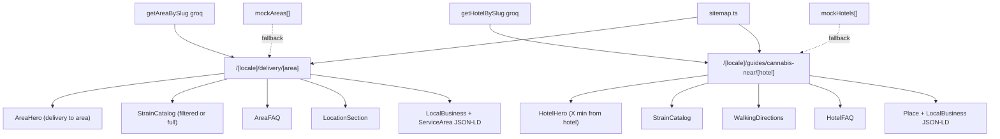

# Site #03 — Programmatic SEO: Area & Hotel Landing Pages

> **Перед стартом:** прочитай [`docs/growth/README.md`](../README.md) для shared context.

## TL;DR

У нас уже есть SEO-маршруты `/strains/effects/[effect]` и `/strains/types/[type]`. Они покрывают product-intent. Но мы **не покрываем geo-intent** запросов вида:

- «weed delivery walking street»
- «cannabis near hard rock hotel pattaya»
- «marijuana jomtien beach»

Это самые конверсионные запросы для late-night impulse и tourist segments. План — добавить два новых семейства маршрутов (area + hotel) через программный SEO, используя существующие Sanity-схемы и mock fallback.

## Архитектура



## Что строим

### 1. Sanity schemas

Создать **два новых документа** в `src/sanity/schemas/`:

**`src/sanity/schemas/area.ts`**

```ts
import { defineField, defineType } from "sanity";

export const area = defineType({
  name: "area",
  title: "Зона доставки (Pattaya)",
  type: "document",
  fields: [
    defineField({ name: "name", title: "Название", type: "string", validation: r => r.required() }),
    defineField({ name: "nameRu", title: "Название (RU)", type: "string" }),
    defineField({ name: "nameTh", title: "Название (TH)", type: "string" }),
    defineField({ name: "slug", title: "Slug", type: "slug", options: { source: "name" }, validation: r => r.required() }),
    defineField({ name: "etaMinutes", title: "ETA в минутах", type: "number", initialValue: 30 }),
    defineField({ name: "shortDescription", title: "Короткое описание (EN)", type: "text", rows: 3 }),
    defineField({ name: "shortDescriptionRu", title: "Короткое описание (RU)", type: "text", rows: 3 }),
    defineField({ name: "shortDescriptionTh", title: "Короткое описание (TH)", type: "text", rows: 3 }),
    defineField({ name: "landmarks", title: "Ориентиры (EN, через запятую)", type: "array", of: [{ type: "string" }] }),
    defineField({ name: "isHidden", title: "Скрыто", type: "boolean", initialValue: false }),
    defineField({ name: "sortOrder", title: "Порядок", type: "number", initialValue: 100 }),
  ],
});
```

**`src/sanity/schemas/hotel.ts`**

```ts
import { defineField, defineType } from "sanity";

export const hotel = defineType({
  name: "hotel",
  title: "Отель (для SEO-страницы)",
  type: "document",
  fields: [
    defineField({ name: "name", title: "Название отеля", type: "string", validation: r => r.required() }),
    defineField({ name: "slug", title: "Slug", type: "slug", options: { source: "name" }, validation: r => r.required() }),
    defineField({ name: "areaRef", title: "Зона", type: "reference", to: [{ type: "area" }] }),
    defineField({ name: "walkingMinutes", title: "Пешком от шопа (мин)", type: "number" }),
    defineField({ name: "deliveryEtaMinutes", title: "Доставка (мин)", type: "number", initialValue: 25 }),
    defineField({ name: "shortDescription", title: "Описание (EN)", type: "text", rows: 3 }),
    defineField({ name: "shortDescriptionRu", title: "Описание (RU)", type: "text", rows: 3 }),
    defineField({ name: "shortDescriptionTh", title: "Описание (TH)", type: "text", rows: 3 }),
    defineField({ name: "googlePlaceId", title: "Google Place ID", type: "string" }),
    defineField({ name: "isHidden", title: "Скрыто", type: "boolean", initialValue: false }),
    defineField({ name: "sortOrder", title: "Порядок", type: "number", initialValue: 100 }),
  ],
});
```

Зарегистрировать в [`src/sanity/schemas/index.ts`](../../../src/sanity/schemas/index.ts):

```ts
import { strain } from "./strain";
import { shopSettings } from "./shopSettings";
import { area } from "./area";
import { hotel } from "./hotel";

export const schemaTypes = [strain, shopSettings, area, hotel];
```

### 2. Types + mock seed

В [`src/lib/mock-data.ts`](../../../src/lib/mock-data.ts) добавить:

```ts
export interface Area {
  _id: string;
  name: string;
  nameRu?: string | null;
  nameTh?: string | null;
  slug: { current: string };
  etaMinutes: number;
  shortDescription: string;
  shortDescriptionRu?: string | null;
  shortDescriptionTh?: string | null;
  landmarks: string[];
  isHidden?: boolean;
  sortOrder: number;
}

export interface Hotel {
  _id: string;
  name: string;
  slug: { current: string };
  areaRef: { _ref: string } | null;
  walkingMinutes?: number | null;
  deliveryEtaMinutes: number;
  shortDescription: string;
  shortDescriptionRu?: string | null;
  shortDescriptionTh?: string | null;
  googlePlaceId?: string | null;
  isHidden?: boolean;
  sortOrder: number;
}

export const mockAreas: Area[] = [
  {
    _id: "a1",
    name: "Walking Street",
    nameRu: "Walking Street",
    nameTh: "Walking Street",
    slug: { current: "walking-street" },
    etaMinutes: 15,
    shortDescription: "Pattaya's main nightlife strip. We're a 5-minute walk into Soi Hollywood.",
    shortDescriptionRu: "Главная ночная улица Паттайи. Мы в 5 минутах пешком в Soi Hollywood.",
    shortDescriptionTh: "ถนนสายกลางคืนหลักของพัทยา ห่างจากร้าน 5 นาทีเดินไปยัง Soi Hollywood",
    landmarks: ["Hard Rock Cafe", "Pier", "Mike Shopping Mall"],
    sortOrder: 1,
  },
  {
    _id: "a2",
    name: "Soi Buakhao",
    slug: { current: "soi-buakhao" },
    etaMinutes: 20,
    shortDescription: "Long-stay tourist street with bars and condos. Quick delivery from us.",
    shortDescriptionRu: "Туристическая улица с барами и кондо. Быстрая доставка от нас.",
    landmarks: ["Soi LK Metro", "Soi Diana"],
    sortOrder: 2,
  },
  {
    _id: "a3",
    name: "Jomtien Beach",
    slug: { current: "jomtien-beach" },
    etaMinutes: 30,
    shortDescription: "Quieter beach south of Pattaya. We deliver 24/7 to all Jomtien condos and hotels.",
    shortDescriptionRu: "Более тихий пляж к югу от Паттайи. Доставляем 24/7 во все отели и кондо Джомтьена.",
    landmarks: ["View Talay condos", "Jomtien Plaza"],
    sortOrder: 3,
  },
  {
    _id: "a4",
    name: "Pratumnak Hill",
    slug: { current: "pratumnak-hill" },
    etaMinutes: 25,
    shortDescription: "Premium residential hill between Pattaya and Jomtien. Discreet hotel delivery.",
    shortDescriptionRu: "Премиум-район между Паттайей и Джомтьеном. Аккуратная доставка в отели.",
    landmarks: ["Cosy Beach", "Big Buddha"],
    sortOrder: 4,
  },
  {
    _id: "a5",
    name: "Naklua",
    slug: { current: "naklua" },
    etaMinutes: 30,
    shortDescription: "North Pattaya quieter side. Delivery to Wong Amat and surrounding condos.",
    shortDescriptionRu: "Северная Паттайя, более тихая сторона. Доставка в Wong Amat и кондо рядом.",
    landmarks: ["Wong Amat Beach", "Terminal 21"],
    sortOrder: 5,
  },
  {
    _id: "a6",
    name: "Pattaya Klang",
    slug: { current: "pattaya-klang" },
    etaMinutes: 15,
    shortDescription: "Central Pattaya. Closest to the shop — fastest delivery times.",
    shortDescriptionRu: "Центральная Паттайя. Ближе всего к магазину — самая быстрая доставка.",
    landmarks: ["Central Festival", "Royal Garden Plaza"],
    sortOrder: 6,
  },
];

export const mockHotels: Hotel[] = [
  // ~10–15 топ-отелей. Примеры:
  { _id: "h1", name: "Hard Rock Hotel Pattaya", slug: { current: "hard-rock-hotel-pattaya" }, areaRef: { _ref: "a6" }, walkingMinutes: 8, deliveryEtaMinutes: 15, shortDescription: "Right on Pattaya Beach Road. We deliver 24/7 to Hard Rock — usually under 20 min.", sortOrder: 1 },
  { _id: "h2", name: "Centara Grand Mirage Beach Resort", slug: { current: "centara-grand-mirage" }, areaRef: { _ref: "a5" }, walkingMinutes: null, deliveryEtaMinutes: 30, shortDescription: "Wong Amat north. 24/7 delivery to your room.", sortOrder: 2 },
  // ... докинуть Hilton Pattaya, Holiday Inn Pattaya, Royal Cliff, Grande Centre Point, A-One Royal Cruise, Mövenpick Siam, Centara Pattaya, Amari Pattaya, Pullman Pattaya
];
```

### 3. GROQ-запросы с fallback

В [`src/lib/queries.ts`](../../../src/lib/queries.ts) добавить функции:

- `getAllAreas(): Promise<Area[]>` — sanity GROQ + fallback `mockAreas`
- `getAreaBySlug(slug: string): Promise<Area | null>` — sanity GROQ + fallback из `mockAreas`
- `getAllHotels(): Promise<Hotel[]>` — sanity GROQ + fallback `mockHotels`
- `getHotelBySlug(slug: string): Promise<Hotel | null>` — sanity GROQ + fallback

Cache tags: `area:${slug}`, `hotel:${slug}`, `areas`, `hotels` — для совместимости с существующим `/api/revalidate`.

### 4. Маршруты

#### `src/app/[locale]/delivery/[area]/page.tsx`

Структура страницы (компонент):

```tsx
export default async function AreaDeliveryPage({ params }) {
  const { locale, area: areaSlug } = await params;
  const [area, strains, shopSettings] = await Promise.all([
    getAreaBySlug(areaSlug),
    getAllStrains(),
    getShopSettings(),
  ]);
  if (!area || area.isHidden) notFound();

  return (
    <>
      <AreaHero area={area} shopSettings={shopSettings} locale={locale} />
      <SocialProofStrip ... />
      <FulfillmentOptions shopSettings={shopSettings} locale={locale} />
      <StrainCatalog strains={strains} shopSettings={shopSettings} />
      <AreaFAQ area={area} locale={locale} />
      <LocationSection ... />
      <ContactSection shopSettings={shopSettings} />
      <Footer shopSettings={shopSettings} />
    </>
  );
}

export async function generateStaticParams() {
  const areas = await getAllAreas();
  const locales = ["en", "ru", "th"];
  return locales.flatMap(locale =>
    areas.filter(a => !a.isHidden).map(a => ({ locale, area: a.slug.current }))
  );
}

export async function generateMetadata({ params }) {
  // localized title: "{area name} cannabis delivery in Pattaya | 24/7 to your hotel — Labs Cannabis"
}
```

`AreaHero` — упрощённая версия `Hero.tsx`, главное:

- H1: `Cannabis delivery to {area.name} — 24/7`
- Sub: `{area.shortDescription} Average delivery: ~{area.etaMinutes} min.`
- Primary CTA: WhatsApp с `kind: "delivery"` и `productName: area name` (передать через дополнительный параметр в `createContactMessage` или новый kind `"area-delivery"` — см. Site #06 про UTM).

JSON-LD: `LocalBusiness` + `Service` с `areaServed: { @type: "AdministrativeArea", name: area.name }`.

#### `src/app/[locale]/guides/cannabis-near/[hotel]/page.tsx`

Аналогично, но H1: `Cannabis delivery to {hotel.name} in Pattaya — 24/7`. Включает дополнительный блок «Walking from {hotel.name}» (если `walkingMinutes` указан) с пошаговой инструкцией.

### 5. Sitemap + hreflang

Расширить [`src/app/sitemap.ts`](../../../src/app/sitemap.ts):

- Для каждой area × locale → URL `/{locale}/delivery/{slug}`
- Для каждого hotel × locale → URL `/{locale}/guides/cannabis-near/{slug}`
- Добавить `alternates.languages` для hreflang.

### 6. Internal linking

В `src/components/FulfillmentOptions.tsx` или новом компоненте `<DeliveryAreasGrid />` (вставить ниже `FulfillmentOptions` на главной) — список 6 areas с ссылками на `/[locale]/delivery/[area]`. Это создаёт internal linking структуру и даёт пользователю CTA.

## Стартовый контент (что заполнить руками)

**6 areas** (полностью описаны в mock seed выше):

1. Walking Street
2. Soi Buakhao
3. Jomtien Beach
4. Pratumnak Hill
5. Naklua
6. Pattaya Klang

**10–15 hotels** (примерный список — уточни актуальные у Dima перед публикацией):

1. Hard Rock Hotel Pattaya
2. Centara Grand Mirage (Wong Amat)
3. Hilton Pattaya
4. Holiday Inn Pattaya
5. Royal Cliff Beach Resort
6. Grande Centre Point Pattaya
7. A-One The Royal Cruise
8. Mövenpick Siam Hotel Na Jomtien
9. Centara Pattaya
10. Amari Pattaya
11. Pullman Pattaya Hotel G
12. Sheraton Pattaya
13. The Bayview Pattaya
14. Mercure Pattaya Ocean Resort
15. Avani Pattaya Resort

Итого: 6 areas × 3 locale = 18 страниц + 15 hotels × 3 locale = 45 страниц. **63 новых SEO-страницы**, всё через одну схему и один шаблон.

## Acceptance criteria

- [ ] Sanity Studio показывает два новых типа документов с возможностью редактирования.
- [ ] Mock fallback работает: при отключённом Sanity (`SANITY_PROJECT_ID` пустой) страницы рендерятся с mock-данными.
- [ ] `/en/delivery/walking-street`, `/ru/delivery/walking-street`, `/th/delivery/walking-street` все возвращают 200 с корректным контентом.
- [ ] `/en/guides/cannabis-near/hard-rock-hotel-pattaya` и его RU/TH варианты возвращают 200.
- [ ] sitemap.xml содержит все 63 новые URL с корректными hreflang alternates.
- [ ] JSON-LD валидируется (LocalBusiness + Service).
- [ ] Primary CTA на каждой area/hotel странице открывает WhatsApp с prefilled-сообщением, включающим название area/hotel.
- [ ] Lighthouse Performance ≥ 85 на mobile для одной area-страницы (тест: walking-street).
- [ ] Internal linking: с главной страницы есть линк-блок на 6 area-страниц.

## Definition of Done

- PR с заголовком `feat(seo): area & hotel programmatic landing pages`.
- В описании PR — список всех 63 URL'ов, скриншот Search Console после indexation request.
- Документ-обновление: добавить в `README.md` главного репо ссылку на новые маршруты.

## Out of scope

- Не трогать `/strains/effects/[effect]` и `/strains/types/[type]` — они работают.
- Не интегрировать Google Places API динамически — на старте достаточно мокового списка отелей.
- Не делать CMS-загрузку фото отелей — для DOM достаточно текста.
- Не строить delivery zone polygon на карте — это отдельная задача (out of scope).
